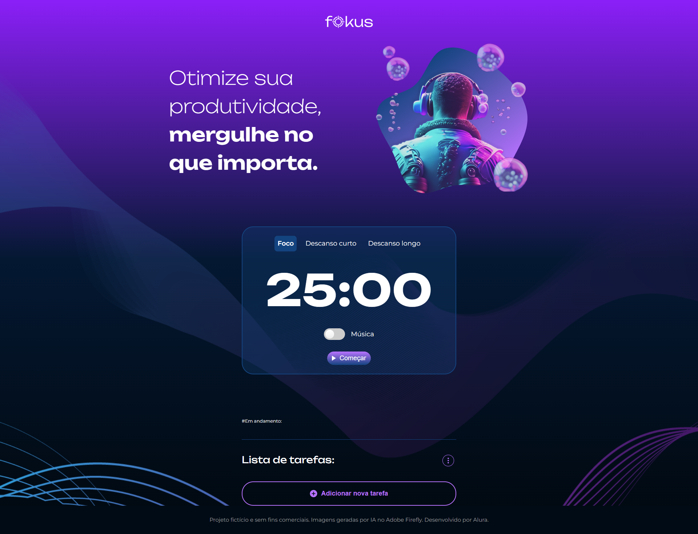
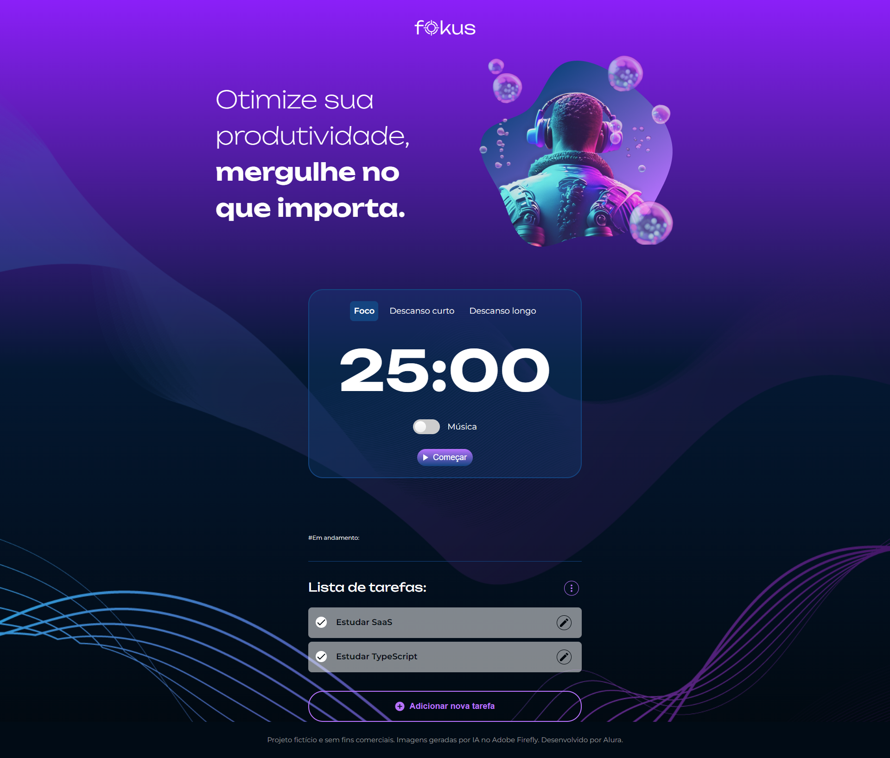

  

Fokus é uma aplicação web simples e interativa que permite aos usuários adicionar, editar, visualizar e remover tarefas, tudo em um ambiente visual agradável e amigável.

## Tecnologias utilizadas durante o curso
* JavaScript
* HTML
* CSS

## Tecnologias utilizadas no projeto
* HTML
* CSS

## O que foi ensinado no curso 

* Identifique e utilize seletores CSS para interagir com elementos HTML através do JavaScript
* Aplique conhecimentos de JavaScript para manipular o DOM
* Gerencie eventos do usuário, como cliques ou envios de formulário
* Resolva problemas relacionados à gestão de estado em aplicações web, utilizando armazenamento local e manipulação de array
* Crie interfaces interativas utilizando elementos dinâmicos e eventos para melhorar a experiência do usuário
* Avalie e implemente estratégias eficientes para a persistência de dados no navegador do cliente através do LocalStorage
* Projete uma aplicação web funcional que emprega práticas de armazenamento e recuperação de dados para persistência de estado entre sessões

## Melhoria apresentada e executada
* Realizei a substituição do metodo confirm() para edição das tarefas, por um pop-up criado com HTML, CSS e JavaScript.

 

 

 

